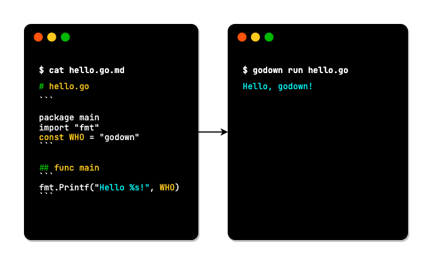
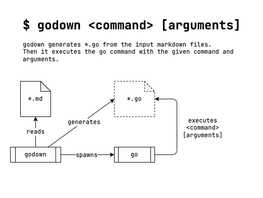

# godown

`godown` is a `go` command wrapper for Markdown files.

`godown` generates `*.go` files from `*.md` files.

You can build and execute go codes written in _Code Blocks_.



- You can add descriptions about go codes with markdown texts, images, and even with tables, in markdown format.

## How it works



1. `godown` extracts go _Code Blocks_ from the input markdown files.
1. Then, it generates go source files.
1. `godown` executes the `gofmt` command to the generated go source files.
1. Finally, `godown` executes `go` command with the given command line arguments.

## Examples

Take a look at [`hello.go.md`](tests/hello/hello.go.md).

You can use `godown` like `go` command, like below:

```go
$ godown run tests/hello/hello.go.md
Hello godown!
```

The source codes of `godown` are an example of `godown`.

It means `godown` itself is built with `godown`.

Look at the source codes written in both of `*.go.md` files and `*.go` files. Compare both of them.

### Usage

```sh
# This just generates '*.go' files.
$ godown

# This generates *.go files implicitly.
# Then, it builds *.go files to a binary
$ godown build

# This generates *.go implicitly at first.
# Then, the go command builds the generated hello.go file, and run it.
$ godown run tests/hello/hello.go.md
Hello godown!
```

## Help

````
$ godown -h
'godown' is a 'make' command wrapper for Markdown files.
You can write 'make' targets in 'Makefile.md' or 'README.md', etc.
'godown' executes 'make' targets written in *.md files by the 'make' command.

For more information,
  https://github.com/hirokistring/godown

Usage:
  godown <command> [arguments] ..

Examples:
  $ cat hello.go.md

  # hello.go
    ```
    package main
    import "fmt"
    const WHO = "godown"
    ```
  ## func main
    ```
    fmt.Printf("Hello, %s\n", WHO)
    ```

  $ godown run hello.go.md
  Hello, godown!


Flags:
  -h, --help              help for godown
      --verbose           prints verbose messages
  -v, --version           version for godown
````

Other command line arguments will be passed to the `go` command at the run time.
Threfore, you can use the almost all command line options of the `go` command.

## How to install

Download and extract the `godown` executable file from the [Releases](https://github.com/hirokistring/godown/releases) page.
