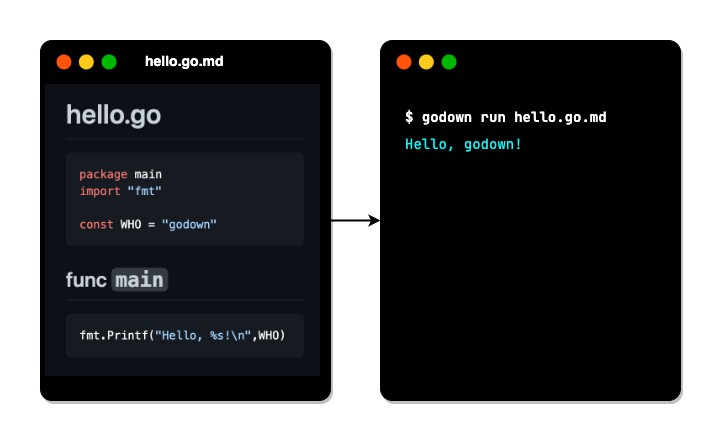

# Integrating Go code and the documentation with `godown`

## What is `godown` ?

`godown` is a `go` command wrapper for Markdown files.

You can build and execute Go _Code Blocks_ in markdown files, like `go` command.



You can integrate Go source codes and the documentation into the same Markdown files.

## Why `godown` ?

Because it is easy to understand when the specification and the source code are located in the same place.

## Examples

Take a look at [`hello.go.md`](tests/hello/hello.go.md).

You can use `godown` like `go` command, like below:

```go
$ godown run tests/hello/hello.go.md
Hello godown!
```

The source codes of `godown` are also an example of `godown`.

It means `godown` itself is built with `godown`.

Look at the source codes written in both of `*.go.md` files and `*.go` files.

Compare both of them.

## How it works


1. `godown` extracts go _Code Blocks_ from the input markdown files.
1. Then, it generates go source files.
1. `godown` executes the `gofmt` command to the generated go source files.
1. Finally, `godown` executes `go` command with the given command line arguments.

## How to install

```
go install github.com/hirokistring/godown
```

Or, download and extract the `godown` executable file from the [Releases](https://github.com/hirokistring/godown/releases) page.

### Usage

```sh
# This just generates '*.go' files.
$ godown

# This generates *.go files implicitly.
# Then, it builds *.go files to a binary
$ godown build

# This generates *.go implicitly at first.
# Then, the go command builds the generated hello.go file, and run it.
$ godown run tests/hello/hello.go.md
Hello godown!
```

## Help

````
$ godown -h
'godown' is a 'make' command wrapper for Markdown files.
You can write 'make' targets in 'Makefile.md' or 'README.md', etc.
'godown' executes 'make' targets written in *.md files by the 'make' command.

For more information,
  https://github.com/hirokistring/godown

Usage:
  godown <command> [arguments] ..

Examples:
  $ cat hello.go.md

  # hello.go
    ```
    package main
    import "fmt"
    const WHO = "godown"
    ```
  ## func main
    ```
    fmt.Printf("Hello, %s\n", WHO)
    ```

  $ godown run hello.go.md
  Hello, godown!


Flags:
  -h, --help              help for godown
      --verbose           prints verbose messages
  -v, --version           version for godown
````

Other command line arguments will be passed to the `go` command at the run time.
Threfore, you can use the almost all command line options of the `go` command.

## _Pros_ and _Cons_

Is writing Go codes in `*.md` files with `godown` really better than writing Go codes in `*.go` files?

What is the _Pros and Cons_ in comparing with writing Go codes in `*.go` files.

### _Pros_

- Markdown is richer than source code comments to describe the specifications.
  - You can use images, tables to describe the specification, error conditions, etc.
- Go syntax highlighting for `go` Code Blocks in markdown file is supported by code editor like vscode.

### _Cons_

- No code completion, parameter info, etc. for `go` Code Blocks in markdown files by code editors.
- Line numbers does not match when compile errors occurred, because the line numbers are reported by `go` command for the generated `*.go` files.

## Best Practices

Because there are the **_Pros_** and **_Cons_** above, it is recommended to use `godown` **_before_** you write the codes to design the specifications about functions. Or, use it **_after_** you write the codes to add the explanations.

Therefore, `godown` is still an _experimental_ project to evaluate the initial idea. But it is worth to try. Please leave your comments.
